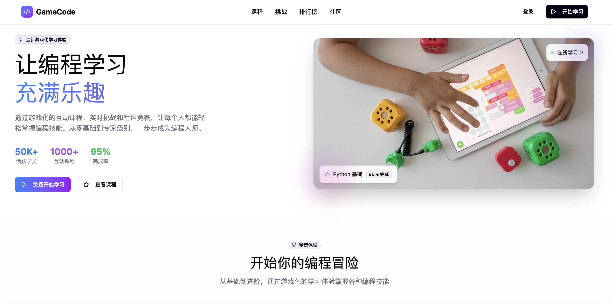
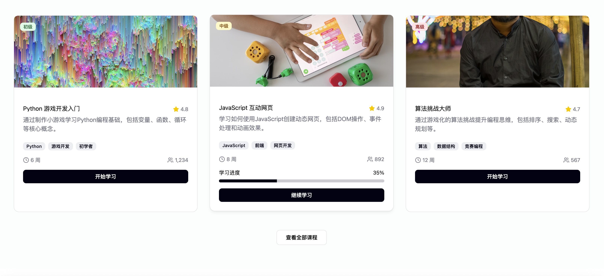
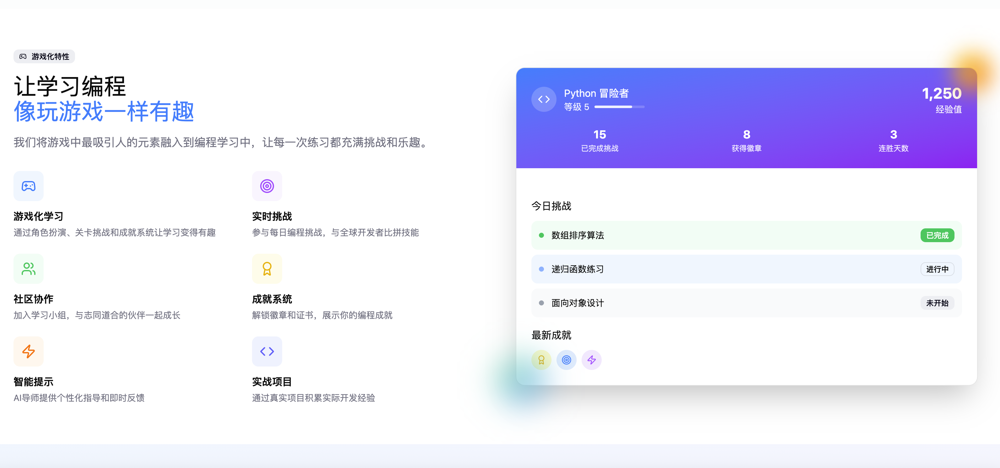

# Gamify Education Platform

A modern, gamified educational platform built with React, TypeScript, and Vite. This project transforms traditional learning into an engaging, game-like experience.

## Screenshots





## 🎮 Features

- **Gamified Learning Experience**: Interactive courses with game mechanics
- **Modern UI/UX**: Built with Radix UI components and Tailwind CSS
- **Responsive Design**: Works seamlessly across all devices
- **Dark/Light Theme**: Toggle between themes for better user experience
- **Progress Tracking**: Visual progress indicators and achievements
- **Interactive Components**: Engaging UI elements and animations

## 🚀 Tech Stack

- **Frontend**: React 18, TypeScript, Vite
- **Styling**: Tailwind CSS, Radix UI
- **Icons**: Lucide React
- **Charts**: Recharts
- **Animations**: CSS animations and transitions

## 📦 Installation

1. Clone the repository:
```bash
git clone https://github.com/BinLe1988/gamify-edu.git
cd gamify-edu
```

2. Install dependencies:
```bash
npm install
```

3. Start the development server:
```bash
npm run dev
```

4. Open your browser and navigate to `http://localhost:3000`

## 🛠️ Available Scripts

- `npm run dev` - Start development server
- `npm run build` - Build for production
- `npm run preview` - Preview production build locally

## 📁 Project Structure

```
gamify-edu/
├── src/
│   ├── components/     # Reusable UI components
│   │   ├── ui/        # Base UI components (buttons, cards, etc.)
│   │   ├── Header.tsx
│   │   ├── Hero.tsx
│   │   ├── FeaturedCourses.tsx
│   │   ├── GameFeatures.tsx
│   │   ├── Stats.tsx
│   │   └── Footer.tsx
│   ├── styles/        # Global styles
│   ├── App.tsx        # Main application component
│   ├── main.tsx       # Application entry point
│   └── index.css      # Global CSS
├── public/            # Static assets
├── package.json
└── README.md
```

## 🎨 Design

This project is based on the Figma design: [多游戏化教学网站设计](https://www.figma.com/design/6pVfmrZUTCvqJHa4OZEy2P/%E5%A4%9A%E6%B8%B8%E6%88%8F%E5%8C%96%E6%95%99%E5%AD%A6%E7%BD%91%E7%AB%99%E8%AE%BE%E8%AE%A1--Community-)

## 🤝 Contributing

1. Fork the repository
2. Create your feature branch (`git checkout -b feature/amazing-feature`)
3. Commit your changes (`git commit -m 'Add some amazing feature'`)
4. Push to the branch (`git push origin feature/amazing-feature`)
5. Open a Pull Request

## 📄 License

This project is licensed under the MIT License - see the [LICENSE](LICENSE) file for details.

## 🙏 Acknowledgments

- Design inspiration from the Figma community
- Built with modern React ecosystem tools
- UI components powered by Radix UI
